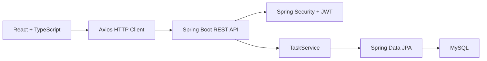

# TaskFlow

TaskFlow es una aplicación full-stack de gestión personal de tareas, construida con React, TypeScript, Spring Boot y MySQL. El proyecto está enfocado en demostrar un flujo completo de desarrollo: autenticación con JWT, tareas privadas por usuario, API REST protegida, persistencia en base de datos, manejo de errores en la interfaz y tests de lógica de negocio.

> Proyecto desarrollado como portfolio técnico para roles junior de desarrollo full-stack.

## Vista General

TaskFlow permite a cada usuario registrarse, iniciar sesión y gestionar sus propias tareas en un tablero tipo Kanban. Las tareas se organizan por estado, prioridad y fecha de vencimiento. Cada usuario solo puede ver, editar y eliminar sus propias tareas.

## Funcionalidades

- Registro e inicio de sesión de usuarios.
- Autenticación basada en JWT.
- Tareas asociadas al usuario autenticado.
- CRUD completo de tareas.
- Estados: `PENDIENTE`, `EN_PROGRESO`, `COMPLETADO`.
- Prioridades: `BAJA`, `MEDIA`, `ALTA`.
- Fecha de vencimiento opcional.
- Filtros por búsqueda y prioridad.
- Animación visual al completar tareas.
- Mensajes de error en operaciones de carga, creación, edición, borrado y cambio de estado.
- API con DTOs para evitar exponer entidades JPA directamente.
- Tests unitarios para la lógica de tareas asociadas a usuario.

## Stack Tecnológico

### Frontend

- React
- TypeScript
- Vite
- Axios
- CSS-in-JS con estilos inline

### Backend

- Java 21
- Spring Boot
- Spring Security
- Spring Data JPA
- JWT
- Bean Validation
- MySQL
- Maven
- JUnit 5
- Mockito

## Arquitectura



## Seguridad y Diseño de API

El backend protege los endpoints de tareas mediante JWT. El token se envía desde el frontend en la cabecera:

```http
Authorization: Bearer <token>
```

Las tareas no se consultan globalmente. Cada operación utiliza el usuario extraído del token para asegurar que un usuario no pueda acceder a tareas de otro usuario.

Además, la API usa DTOs:

- `TaskRequest`: datos aceptados al crear o actualizar tareas.
- `TaskResponse`: datos devueltos al frontend.

Esto evita devolver directamente entidades JPA y reduce el riesgo de exponer datos internos como la relación `user` o información sensible.

## Estructura del Proyecto

```text
Taskflow/
├── frontend/
│   ├── src/
│   │   ├── api/
│   │   ├── pages/
│   │   ├── types/
│   │   └── App.tsx
│   └── package.json
│
└── backend/
    ├── src/main/java/com/example/backend/
    │   ├── config/
    │   ├── controller/
    │   ├── dto/
    │   ├── model/
    │   ├── repository/
    │   └── service/
    ├── src/test/
    └── pom.xml
```

## Cómo Ejecutarlo en Local

### Requisitos

- Node.js
- npm
- Java 21 o superior
- MySQL
- Maven Wrapper incluido en el backend

### 1. Clonar el repositorio

```bash
git clone https://github.com/delbandb/TaskFlow.git
cd TaskFlow
```

### 2. Configurar MySQL

Crea una base de datos local:

```sql
CREATE DATABASE taskflow;
```

Configura el backend en `backend/src/main/resources/application.properties`:

```properties
spring.datasource.url=jdbc:mysql://localhost:3306/taskflow
spring.datasource.username=root
spring.datasource.password=
spring.datasource.driver-class-name=com.mysql.cj.jdbc.Driver
spring.jpa.hibernate.ddl-auto=update
server.port=8080
```

### 3. Ejecutar Backend

```bash
cd backend
./mvnw spring-boot:run
```

En Windows:

```powershell
cd backend
.\mvnw spring-boot:run
```

El backend se ejecuta en:

```text
http://localhost:8080
```

### 4. Ejecutar Frontend

```bash
cd frontend
npm install
npm run dev
```

El frontend se ejecuta en:

```text
http://localhost:5173
```

## Tests

### Backend

```bash
cd backend
./mvnw test
```

En Windows:

```powershell
cd backend
.\mvnw test
```

Los tests cubren:

- Creación de tareas asociadas al usuario autenticado.
- Listado de tareas solo del usuario autenticado.
- Actualización de tareas propias.
- Eliminación de tareas propias.
- Carga del contexto de Spring Boot.

### Frontend

```bash
cd frontend
npm run build
```

El build valida TypeScript y genera la versión de producción con Vite.

## Endpoints Principales

### Autenticación

```http
POST /api/auth/register
POST /api/auth/login
```

### Tareas

```http
GET    /api/tasks
GET    /api/tasks/{id}
POST   /api/tasks
PUT    /api/tasks/{id}
PATCH  /api/tasks/{id}/status
DELETE /api/tasks/{id}
```

Todos los endpoints de tareas requieren JWT.

## Variables de Entorno Recomendadas para Producción

Antes de publicar el proyecto, conviene mover valores sensibles a variables de entorno:

```properties
spring.datasource.url=${DATABASE_URL}
spring.datasource.username=${DATABASE_USERNAME}
spring.datasource.password=${DATABASE_PASSWORD}
jwt.secret=${JWT_SECRET}
```

En el frontend:

```env
VITE_API_URL=https://tu-backend.com/api
```

## Decisiones Técnicas

- Se eligió JWT para practicar autenticación stateless.
- Se añadieron DTOs para separar la API pública del modelo de persistencia.
- Las tareas se filtran por usuario en el backend, no solo en el frontend.
- Se añadieron mensajes de error para evitar fallos silenciosos en la experiencia de usuario.
- Se mantuvo una interfaz sencilla, clara y enfocada en productividad.

## Qué Aprendí Construyendo TaskFlow

- Integrar React con una API REST real.
- Proteger rutas backend con Spring Security y JWT.
- Gestionar CORS entre frontend y backend.
- Diseñar relaciones entre entidades JPA.
- Evitar exponer entidades internas mediante DTOs.
- Escribir tests unitarios con JUnit y Mockito.
- Depurar errores reales de integración entre frontend, backend y base de datos.

## Próximas Mejoras

- Desplegar frontend en Vercel y backend con base de datos MySQL en Railway.
- Añadir documentación OpenAPI/Swagger.
- Añadir tests de integración para endpoints REST.
- Añadir tests frontend con React Testing Library.
- Añadir página de política de privacidad para publicación pública.
- Mejorar diseño responsive para pantallas pequeñas.

## Estado del Proyecto

Proyecto funcional y preparado para portfolio. Actualmente está orientado a ejecución local y listo para una futura publicación en internet con variables de entorno, dominio público y documentación adicional de despliegue.

## Autor

Desarrollado por **delbandb** como proyecto de portfolio full-stack.

